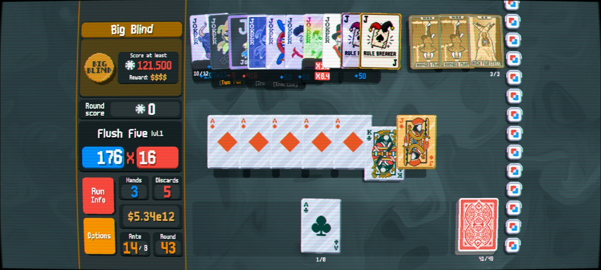
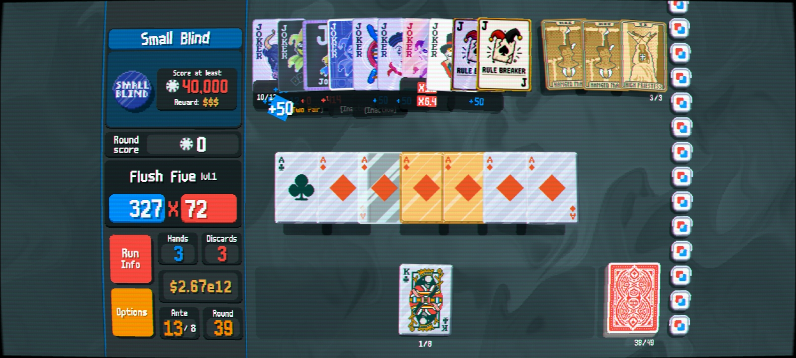
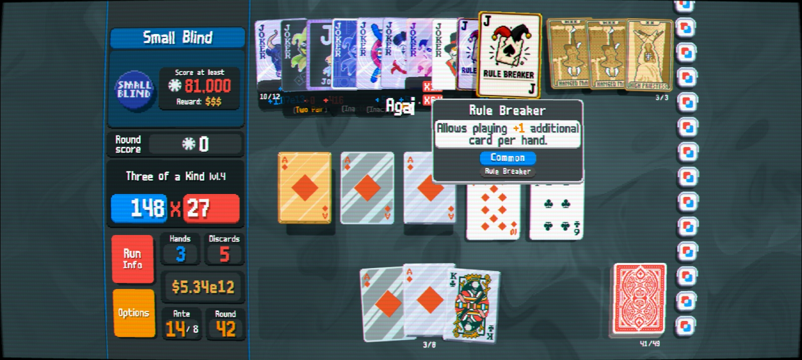

Rule Breaker

A Balatro mod and API that allows hands to exceed the normal 5-card limit.

Rule Breaker introduces support for playing and discarding additional cards through Joker effects and other custom mechanics. Designed to work with Steamodded and modded Balatro setups.

Features

Increase playable hand size dynamically

Increase discard selection size

Joker-driven hand expansion

API support for other mods

Compatible with Steamodded

Lightweight implementation

Preview

Ignore extra stuff, was testing.

One additional card play/discard per joker

Base game compatibility 

custom Hand Support

Mod Showcase

Installation

requirements:

Steamodded 1*

Lovely Injector 0.7*

After-Five-Api 1

Place the mod folder inside your Balatro mods directory.

Launch the game.

Example

The Rule Breaker Joker increases the maximum selectable cards by +1.

Multiple copies stack together.

Compatibility & recommendations 

it should be compatible with most mods as long as they Don't override core game logic. 
For best experience use 6 suits mod.

Credits

Created for Balatro modding and custom gameplay experimentation.

Inspired by chaotic deckbuilding mechanics and hand-limit breaking gameplay.

